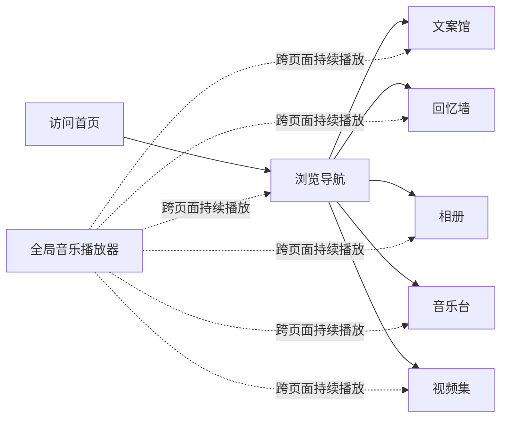

## 1. 产品概述

个人情感回忆收藏馆 —— 一个温暖私密的个人空间，用于收藏和展示喜欢的文案、感情经历、照片、音乐和视频，记录美好回忆。
- 目标用户：个人使用，用于珍藏情感回忆与美好瞬间
- 产品价值：打造专属的数字记忆空间，让回忆有处安放

## 2. 核心功能

### 2.1 功能模块
1. **首页**：精选内容展示、导航入口、欢迎语
2. **文案馆**：文案/句子收藏展示，支持分类浏览
3. **回忆墙**：感情经历时间线，聊天记录文字+截图展示
4. **相册**：照片画廊，网格布局，大图预览
5. **音乐台**：背景音乐歌单，全局播放器
6. **视频集**：视频列表，在线播放

### 2.2 页面详情

| 页面名称 | 模块名称 | 功能描述 |
|----------|----------|----------|
| 首页 | Hero 区域 | 大标题、副标题、温暖背景图、渐入动画 |
| 首页 | 精选卡片 | 各模块精选内容预览，点击跳转 |
| 首页 | 导航栏 | 顶部导航，响应式菜单 |
| 文案馆 | 分类筛选 | 按分类标签筛选文案 |
| 文案馆 | 文案卡片 | 瀑布流/网格布局展示文案，悬停动效 |
| 回忆墙 | 时间线 | 垂直时间线布局，按时间倒序展示 |
| 回忆墙 | 回忆卡片 | 包含日期、标题、文字内容、图片 |
| 相册 | 分类导航 | 相册分类切换 |
| 相册 | 图片网格 | 响应式网格布局，懒加载 |
| 相册 | 灯箱预览 | 点击放大，左右切换，关闭按钮 |
| 音乐台 | 歌单列表 | 歌曲列表，点击播放 |
| 音乐台 | 播放器详情 | 封面、歌词、进度条 |
| 视频集 | 视频网格 | 视频封面网格布局 |
| 视频集 | 视频播放器 | 内嵌播放器，支持全屏 |
| 全局 | 底部播放器 | 悬浮底部，跨页面播放，播放控制 |
| 全局 | 页脚 | 版权信息、回到顶部 |

## 3. 核心流程

用户访问首页 → 浏览各模块入口 → 点击进入对应页面 → 查看内容（文案/照片/回忆/音乐/视频）→ 全局音乐播放器持续播放

## 4. 用户界面设计

### 4.1 设计风格

**暖色调温馨风**

- **主色调**：
  - 主色：暖米色 `#FFF8F0`（背景）
  - 辅色：暖棕色 `#D4A574`（强调色）
  - 点缀色：淡粉色 `#F5E6D3`、柔金色 `#E8C4A0`
  - 文字色：深棕色 `#5C4033`、中褐色 `#8B7355`

- **按钮风格**：
  - 圆角大按钮，柔和阴影
  - 悬停时微微上浮+颜色加深
  - 点击有按压反馈

- **字体选择**：
  - 标题：手写风格字体（如 Ma Shan Zheng / 宋体变体）
  - 正文：优雅衬线或圆润无衬线（如 Noto Serif SC / 思源宋体）
  - 整体字号偏大，阅读舒适

- **布局风格**：
  - 卡片式布局，大圆角，柔和阴影
  - 大量留白，呼吸感强
  - 装饰性元素：花纹分隔线、小图标点缀

- **图标风格**：
  - 线性图标，暖棕色
  - 辅以温柔的 emoji 点缀（🌸、📖、💌、🖼️、🎵、🎬）

### 4.2 页面设计概览

| 页面名称 | 模块名称 | UI 元素 |
|----------|----------|---------|
| 首页 | Hero 区域 | 大标题渐变出现、副标题淡入、背景图柔和模糊、装饰性花纹 |
| 首页 | 精选卡片 | 6个模块入口卡片，悬停上浮，图标+标题+描述 |
| 文案馆 | 文案卡片 | 不规则瀑布流， Quote 引号装饰，分类标签 |
| 回忆墙 | 时间线 | 左侧时间轴圆点，右侧卡片，交替布局，滚动渐入 |
| 相册 | 图片网格 | 等宽不等高瀑布流，圆角，悬停放大微动效 |
| 音乐台 | 歌单列表 | 左侧封面，右侧歌名歌手，播放状态指示 |
| 视频集 | 视频卡片 | 封面+播放按钮，标题，悬停放大 |
| 全局 | 底部播放器 | 迷你播放器，封面+歌名+控制按钮，可展开/收起 |

### 4.3 响应式设计

- 设计原则：Desktop-first，向下兼容
- 断点设置：
  - 桌面端：≥ 1200px（标准布局）
  - 平板端：768px - 1199px（网格列数减少，导航简化）
  - 移动端：< 768px（单列布局，汉堡菜单，底部播放器适配）
- 触控优化：按钮最小 44px，触摸反馈明显

### 4.4 动画效果

- **页面入场**：内容从下往上渐入，错开延迟
- **滚动触发**：时间线、图片等元素滚动到视口时渐入
- **悬停效果**：卡片微微上浮+阴影加深，图片轻微放大
- **播放器**：封面旋转动画，进度条平滑过渡
- **页面切换**：淡出淡入过渡
- **全局背景音乐**：播放时封面缓慢旋转
