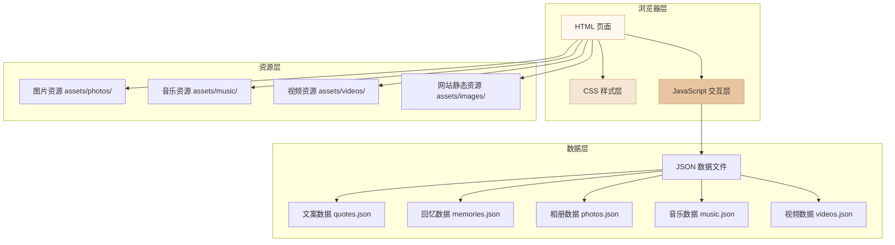

## 1. 架构设计



## 2. 技术说明

- **前端技术**：原生 HTML5 + CSS3 + JavaScript (ES6+)
- **页面切换方案**：PJAX 模式（History API + Fetch 动态加载内容），实现全局音乐播放器跨页面不中断
- **CSS 架构**：CSS 变量 + BEM 命名规范 + 分层样式文件
- **布局方案**：CSS Grid + Flexbox
- **动画方案**：CSS3 @keyframes + transition + Intersection Observer 滚动触发
- **图标方案**：Font Awesome 6（CDN 引入）
- **字体方案**：Google Fonts（Ma Shan Zheng + Noto Serif SC）
- **构建工具**：无（纯静态，无需构建）
- **部署方式**：GitHub Pages
- **兼容性目标**：Chrome 80+、Firefox 75+、Safari 13+、Edge 80+

## 3. 页面路由定义

| 页面路径 | 页面文件 | 功能说明 |
|----------|----------|----------|
| `/` 或 `/index.html` | `index.html` | 首页 - 精选内容与导航入口 |
| `/quotes.html` | `quotes.html` | 文案馆 - 文案收藏展示 |
| `/memories.html` | `memories.html` | 回忆墙 - 时间线展示 |
| `/gallery.html` | `gallery.html` | 相册 - 照片画廊 |
| `/music.html` | `music.html` | 音乐台 - 歌单与播放器 |
| `/videos.html` | `videos.html` | 视频集 - 视频列表 |

## 4. 目录结构

```
/workspace/
├── index.html                  # 首页
├── quotes.html                 # 文案馆
├── memories.html               # 回忆墙
├── gallery.html                # 相册
├── music.html                  # 音乐台
├── videos.html                 # 视频集
│
├── css/
│   ├── variables.css           # CSS 变量（颜色、字体、间距）
│   ├── base.css                # 基础样式重置、通用样式
│   ├── layout.css              # 布局样式（导航、页脚、容器）
│   ├── components.css          # 组件样式（卡片、按钮、播放器等）
│   ├── animations.css          # 动画效果
│   └── responsive.css          # 响应式媒体查询
│
├── js/
│   ├── main.js                 # 主入口（导航、PJAX 页面切换）
│   ├── player.js               # 全局音乐播放器
│   ├── quotes.js               # 文案馆逻辑
│   ├── memories.js             # 回忆墙逻辑
│   ├── gallery.js              # 相册逻辑（灯箱、懒加载）
│   ├── music.js                # 音乐台逻辑
│   ├── videos.js               # 视频集逻辑
│   └── utils/
│       ├── data-loader.js      # JSON 数据加载工具
│       └── scroll-animation.js # 滚动动画工具
│
├── data/
│   ├── quotes.json             # 文案数据
│   ├── memories.json           # 回忆数据
│   ├── photos.json             # 相册数据
│   ├── music.json              # 音乐数据
│   └── videos.json             # 视频数据
│
└── assets/
    ├── images/                 # 网站静态图片（背景、装饰、图标）
    ├── photos/                 # 相册照片
    ├── music/                  # 音乐文件
    └── videos/                 # 视频文件
```

## 5. 数据模型

### 5.1 文案数据 (quotes.json)

```json
{
  "categories": ["治愈", "爱情", "励志", "诗意"],
  "quotes": [
    {
      "id": 1,
      "content": "文案内容...",
      "author": "作者/出处",
      "category": "爱情",
      "date": "2024-01-01"
    }
  ]
}
```

### 5.2 回忆数据 (memories.json)

```json
{
  "memories": [
    {
      "id": 1,
      "date": "2024-01-01",
      "title": "回忆标题",
      "content": "文字描述...",
      "images": ["assets/photos/memory1/1.jpg"],
      "type": "chat"
    }
  ]
}
```

### 5.3 相册数据 (photos.json)

```json
{
  "albums": [
    {
      "id": 1,
      "name": "相册名",
      "cover": "assets/photos/album1/cover.jpg",
      "photos": [
        {
          "id": 1,
          "src": "assets/photos/album1/1.jpg",
          "title": "照片标题",
          "date": "2024-01-01"
        }
      ]
    }
  ]
}
```

### 5.4 音乐数据 (music.json)

```json
{
  "songs": [
    {
      "id": 1,
      "title": "歌曲名",
      "artist": "歌手",
      "cover": "assets/images/music/cover1.jpg",
      "src": "assets/music/song1.mp3",
      "duration": "3:45"
    }
  ]
}
```

### 5.5 视频数据 (videos.json)

```json
{
  "videos": [
    {
      "id": 1,
      "title": "视频标题",
      "cover": "assets/images/videos/cover1.jpg",
      "src": "assets/videos/video1.mp4",
      "date": "2024-01-01",
      "description": "视频描述"
    }
  ]
}
```

## 6. 核心技术方案

### 6.1 全局音乐播放器实现方案

采用 **PJAX 页面切换模式** 实现音乐不中断：

1. 页面结构：每个页面都包含相同的导航栏和底部播放器
2. 导航点击时：
   - 阻止默认跳转
   - 使用 `fetch` 请求目标页面 HTML
   - 提取目标页面的主内容区
   - 替换当前页面主内容
   - 使用 `history.pushState` 更新浏览器地址栏
3. 底部播放器始终保留在 DOM 中，播放状态不中断
4. 浏览器前进/后退通过 `popstate` 事件处理

### 6.2 响应式实现方案

- Desktop-first 设计，使用 `max-width` 媒体查询向下兼容
- CSS Grid 自适应列数：`grid-template-columns: repeat(auto-fill, minmax(280px, 1fr))`
- 图片使用 `srcset` + `sizes` 适配不同分辨率
- 移动端导航使用汉堡菜单

### 6.3 性能优化

- 图片懒加载（Intersection Observer API）
- CSS/JS 按页面拆分，减少首屏加载量
- 图片使用 WebP 格式（提供降级方案）
- 音乐预加载策略：`preload="metadata"`

### 6.4 兼容性处理

- CSS 属性加浏览器前缀（使用 autoprefixer 思路手动处理关键属性）
- 不兼容的浏览器显示优雅降级提示
- 图片加载失败显示默认占位图
